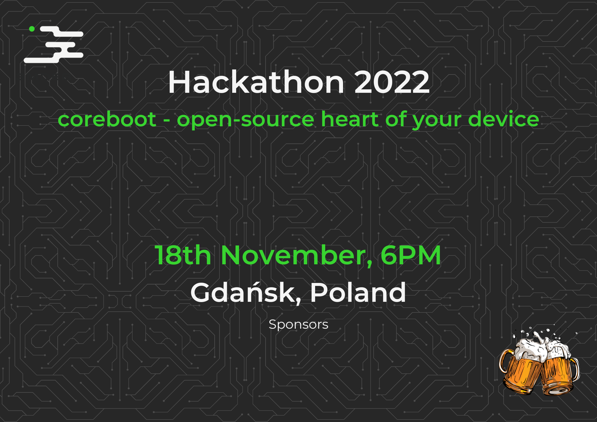

---
hide:
  - navigation
  - toc
---

  
  

 

---

The main theme of this year's hackathon will be coreboot. coreboot is an
extended firmware platform that provides instant and secure booting of
modern computers and embedded systems. As an open source project, it provides
auditability and maximum control over the technology.

Hackathon will be organized in the form of workshop where you will learn how to
flash coreboot on various hardware platforms using DYI and professional tools.
Also bring your own laptop. We will analyze your hardware and feasibility of
coreboot flashing. Don't worry! We can recover it if anything will go wrong.

As an active contributor and promoter of the open-source Dasharo firmware,
the 3mdeb Team wants to familiarize attendees with the process of providing
coreboot support for the selected platform (more information in the near
future). For this part of the event, 3mdeb will provide the necessary hardware.

---

<h2 align="left" style="margin-top: 0px;">
  <b>Calendar Invites:</b>
  <a href="#">iCal</a> /
  <a href="#" target="_blank">Google</a>
</h2>
<h2 align="left" style="margin-top: 0px;">
  <b>Schedule:</b>
  <a href="https://cfp.3mdeb.com/" target="_blank">Hackathon Schedule</a>
</h2>

---

<h1 align="left" style="margin-top: 0px;">
Sign up now at:
<a href="https://cfp.3mdeb.com/hackathon-2022/submit/" target="_blank">https://cfp.3mdeb.com/hackathon-2022/</a>!
</h1>
---

<h1 align="left" style="margin-top: 0px;">
Venue
</h1>

The event will take place at 3mdeb's office, accessible at
Abrahama 1a / 2.05, Gdańsk  80-307:
- [OpenStreetMap](https://www.openstreetmap.org/way/103471012#map=19/54.39267/18.58042)
- [Google Maps](https://goo.gl/maps/9qvAJWsuvD9ECLNM7)

During the event there will be soft drinks and beer, as well as small snacks.

---

<h1 align="left" style="margin-top: 0px;">
Accessibility
</h1>

There is an elevator available to reach the venue. The bathrooms are wheelchair accessible.

---

<h1 align="left" style="margin-top: 0px;">
Registration form
</h1>

Please register your self at <a href="https://cfp.3mdeb.com/hackathon-2022/submit/" target="_blank">https://cfp.3mdeb.com/hackathon-2022/</a>

---
<h1 align="left" style="margin-top: 0px;">
Code of Conduct
</h1>

In the interest of fostering an open and welcoming environment, we as organizers
and maintainers pledge to make the event and our community a harassment-free
experience for everyone, regardless of age, body size, disability, ethnicity,
gender identity and expression, level of experience, nationality, personal
appearance, race, religion, sexual identity and orientation, or other
characteristic.

Examples of behavior that contributes to creating a positive environment include:

*  Using welcoming and inclusive language
*  Being respectful of differing viewpoints and experiences
*  Gracefully accepting constructive criticism
*  Focusing on what is best for the community
*  Showing empathy towards other community members

Examples of unacceptable behavior by participants include:

*  The use of sexualized language or imagery and unwelcome sexual attention
or advances
*  Trolling, insulting/derogatory comments, and personal or political attacks
*  Reinforcing stereotypical models for illustration of non-technical users
(e.g. our mothers/grandmothers, etc.)
*  Public or private harassment, as defined by the Citizen Code of Conduct
*  Publishing others’ private information, such as a physical or electronic
address, without explicit permission
*  Other conduct which could reasonably be considered inappropriate in a
professional setting

---

<h1 align="left" style="margin-top: 0px;">
Health and Safety
</h1>

As the event host, we take your health and the health of the 3mdeb community
seriously. This means you have to be vaccinated or recovered, or to be
boosted or take a same-day negative test before joining the event.
We are compliant with
[polish government recommendations](https://www.gov.pl/web/coronavirus/tips).

---

<h1 align="left" style="margin-top: 0px;">
Hackathon Schedule
</h1>

The full schedule is available at: <a href="https://cfp.3mdeb.com/hackathon-2022/schedule/" target="_blank">https://cfp.3mdeb.com/hackathon-2022/schedule/</a>

---

<h1 align="left" style="margin-top: 0px;">
Recording
</h1>

The live presentation will be recorded, as well as some of the highlights of
the event. By joining the event, you consent to the recording of your image for
marketing purposes.

---
<h1 align="Left" style="margin-top: 0px;">
Social media
</h1>
<h2 align="Left" style="margin-top: 0px;">
  <a href="https://twitter.com/3mdeb_com" target="_blank"> Twitter </a>
 -
  <a href="https://www.reddit.com/user/3mdeb/" target="_blank"> Reddit </a>
 -
  <a href="https://github.com/Dasharo" target="_blank"> Github Dasharo </a>
 -
  <a href="https://github.com/3mdeb" target="_blank"> Github 3mdeb </a>
</h2>

---

<h1 align="Left" style="margin-top: 0px;">
Sponsors

Want to support the Hackathon 2022?
  <a href="https://calendly.com/3mdeb/" target="_blank">Let's talk about it!</a>
