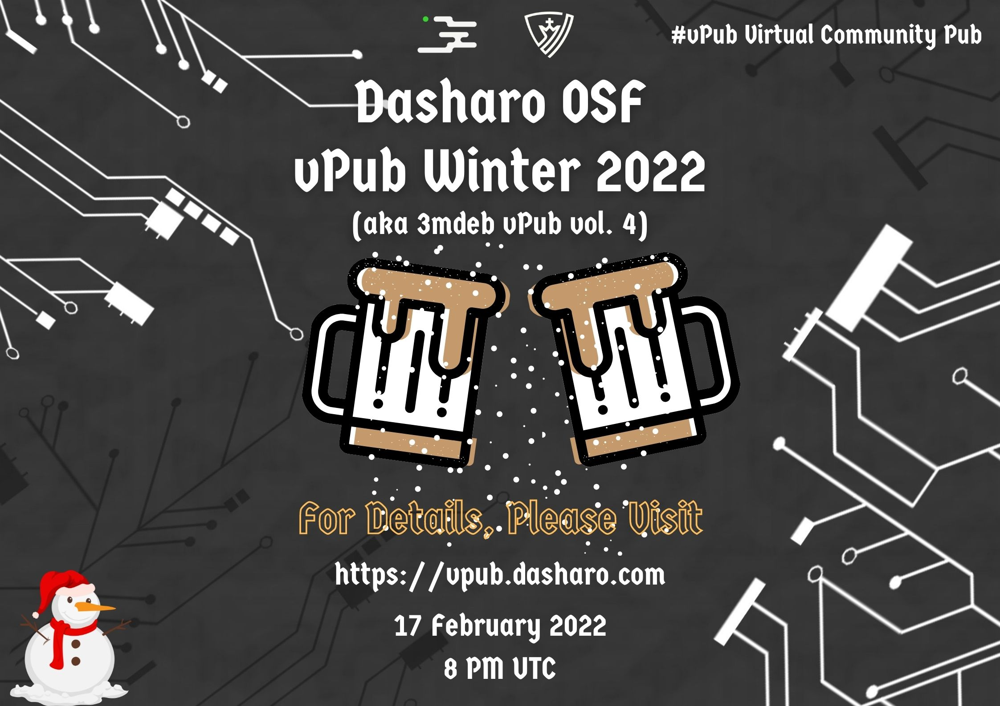

---
hide:
  - navigation
  - toc
--- 

  
  

<h1 align="center" style="margin-top: 0px;">Dasharo OSF vPub Winter 2022</h1>
<h2 align="center" style="margin-top: 0px;">17 February 2022</h2>
<h2 align="center" style="margin-top: 0px;">8 PM UTC - last hacker standing</h2>
<h3 align="center" style="margin-top: 0px;">Calendar Invites: <a href="https://calendar.google.com/event?action=TEMPLATE&tmeid=MjZobm9ydXJuNzQ4OHM3bWszN3I1b2dwbjQgZXZlbnRzQDNtZGViLmNvbQ&tmsrc=events%403mdeb.com">Google</a> / <a href="https://cloud.3mdeb.com/index.php/s/bxWPFbg5PzkDeP2">iCal</a> - click calendar of your choice to add event</h3>

* [Dasharo OSF vPub Matrix room](https://matrix.to/#/#dasharo-osf-vpub:matrix.org) in [Dasharo Workspace (Matrix)](https://matrix.to/#/#dasharo:matrix.org) with embedded Jitsi conference using [Element](https://element.io/get-started). 
Following configuration similar to virtual FOSDEM, we added integration of Jitsi to our Dasharo OSF vPub Matrix channel. 
If you don't have Matrix account, here is a quick guide on [how to get started with Element & Matrix](https://frontpagelinux.com/tutorials/beginners-guide-how-to-get-started-with-element-matrix/) or feel free to use Jitsi directly (link below).
* [Jitsi Conference Link](https://meet.jit.si/dasharo-osf-vpub) - please click to join Jitsi audio (optional video) conference via web browser or mobile app
* [Dasharo Workspace (Matrix)](https://matrix.to/#/#dasharo:matrix.org) - join `#dasharo-osf-vpub:matrix.org` optional Matrix channel for text chat
* [Dasharo OSF vPub Newsletter](https://newsletter.3mdeb.com/subscription/0_K65I7ro) - if you would like to be informed about future vPub events feel free to sign up to our newsletter

<h2 align="center" style="margin-top: 0px;">4th edition of vPub is approaching! We will be discussing lots of interesting topics with many great guests!</h2>

### vPub schedule

| Time [UTC]  | Description                          |
| ----------- | ------------------------------------ |
| **19:30 - 19:50** | Channel open for testing |
| **19:50 - 20:00** | Welcome to vPub |
| **20:00 - 20:10** | Presentation - [Dennis Marttinen](https://twitter.com/twelho) will introduce us to [Racklet](https://racklet.io/) project.
| **20:10 - 20:30** | Q&A - Racklet |
| **20:30 - 21:00** | Open Discussion |
| **21:00 - 21:10** | Presentation - [Michiel Leenaars](https://nlnet.nl/people/leenaars.html) will give us short introduction to [Technology Commons Trust](https://technologycommons.org/) as a vehicle for open source firmware and hardware crowdfunding.
| **21:10 - 21:30** | Q&A - Open source firmware and hardware crowdfunding |
| **21:30 - 22:00** | Open Discussion |
| **22:00 - 22:10** | Presentation - [Luke Kenneth Casson Leighton](http://twitter.com/lkcl) will dive into comparative debugging for [libre-soc](https://libre-soc.org/) by deliberately tracking [microwatt](https://github.com/antonblanchard/microwatt) source and unit tests.
| **22:10 - 22:30** | Q&A - LibreSoC and Microwatt |
| **22:30 - 23:00** | Open Discussion |
| **23:00 - 23:10** | Presentation - [Daniel Maslowski](https://twitter.com/OrangeCMS) will let us know abut current status of [oreboot](https://github.com/oreboot/oreboot) project.
| **23:10 - 23:30** | Q&A - oreboot |
| **23:30 - 00:00** | Open Discussion |
| **00:00 - 00:10** | Presentation - [Felix Singer](https://twitter.com/felixsinger1) and [tonux](https://github.com/Tonux599) will explain how open source firmware community can benefit from [GSoC 2022](https://mail.coreboot.org/hyperkitty/list/coreboot@coreboot.org/thread/PGKTAPC3UEPG722JBUBZYIQQ2UZSGRNA/).
| **00:10 - 00:30** | Q&A - GSoC 2022 for open source firmware |
| **00:30 - 01:00** | Open Discussion: - Crowdfunding of open source firmware distribution for modern platforms ,  - Public review of the open letter draft to open the Intel ACMs code ,  - Open source firmware distribution through fwupd/LVFS ,  - [Dasharo](https://dasharo.com/) project statuses: [KGPE-D16](https://docs.dasharo.com/variants/asus_kgpe_d16/releases/) , [OpenPOWER](https://docs.dasharo.com/variants/talos_2/releases/) , [Dell OptiPlex](https://docs.dasharo.com/variants/dell_optiplex/overview/) , [PC Engines apu2](pcengines.github.io) , modern laptops support [NovaCustom](https://configurelaptop.eu/coreboot-laptop/), - [OpenSecurityTraining2](https://ost2.fyi/) reward system plans and ideas, - Recent advancements in Root of Trust technologies (MS Pluton announcements, TrenchBoot project status) |

### On-going call for participation

At any time feel free to send us suggestions to following sections in form of
[pull requests](https://github.com/Dasharo/vpub/pulls)/[issues](https://github.com/Dasharo/vpub/issues)
or through messages on [Dasharo OSF vPub Matrix channel](https://matrix.to/#/#dasharo-osf-vpub:matrix.org).

* [Projects demo session backlog](projects_backlog.md)
* [Free form discussion topics backlog](topics_backlog.md)
* [Open products advertisement](products_backlog.md)

If you are interested in previous events please visit our [archive](archive.md).
